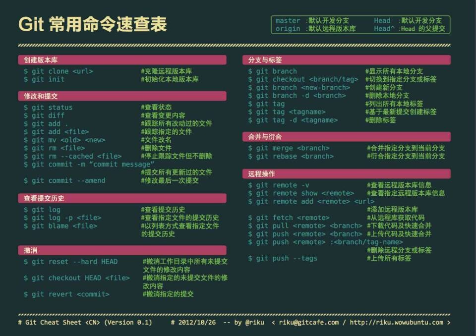

## 配置
### 列出当前配置：
    $ git config --list
### 列出repository配置：
    $ git config --local --list
### 列出全局配置：
    $ git config --global --list
### 列出系统配置：
    $ git config --system --list
### 设置用户名：
    $ git config --global user.name “[firstname lastname]”
### 设置用户邮箱：
    $ git config --global user.email “[valid-email]”
### 设置git命令输出为彩色：
    $ git config --global color.ui auto
### 设置git使用的文本编辑器设：
    $ git config --global core.editor vi
## 配置文件
### Repository配置对应的配置文件路径[--local]：
    /.git/config
### 用户全局配置对应的配置文件路径[--global]：
    ~/.gitconfig
### 系统配置对应的配置文件路径[--local]：
    /etc/gitconfig
## 创建
### 复制一个已创建的仓库:
####  通过 SSH
    $ git clone ssh://user@domain.com/repo.git
#### 通过 HTTP
    $ git clone http://domain.com/user/repo.git
### 创建一个新的本地仓库:
    $ git init
## 本地修改
### 显示工作路径下已修改的文件：
    $ git status
### 显示与上次提交版本文件的不同：
    $ git diff
### 把当前所有修改添加到下次提交中：
    $ git add .
### 把对某个文件的修改添加到下次提交中：
    $ git add -p
### 提交本地的所有修改：
    $ git commit -a
### 提交之前已标记的变化：
    $ git commit
### 附加消息提交：
    $ git commit -m 'message here'
### 提交，并将提交时间设置为之前的某个日期:
    git commit --date="`date --date='n day ago'`" -am "Commit Message"
### 修改上次提交
请勿修改已发布的提交记录!
    $ git commit --amend
### 修改上次提交的committer date：
    GIT_COMMITTER_DATE="date" git commit --amend
### 修改上次提交的author date：
    git commit --amend --date="date"
### 把当前分支中未提交的修改移动到其他分支：
    git stash
    git checkout branch2
    git stash pop
### 将 stashed changes 应用到当前分支：
    git stash apply
### 删除最新一次的 stashed changes：
    git stash drop
## 搜索
### 从当前目录的所有文件中查找文本内容：
    $ git grep "Hello"
### 在某一版本中搜索文本：
    $ git grep "Hello" v2.5
## 提交历史
### 从最新提交开始，显示所有的提交记录（显示hash， 作者信息，提交的标题和时间）：
    $ git log
### 显示所有提交（仅显示提交的hash和message）：
    $ git log --oneline
### 显示某个用户的所有提交：
    $ git log --author="username"
### 显示某个文件的所有修改：
    $ git log -p
### 仅显示远端<remote/master>分支与远端<origin/master>分支提交记录的差集：
    $ git log --oneline .. --left-right
### 谁，在什么时间，修改了文件的什么内容：
    $ git blame
### 显示reflog：
    $ git reflog show
### 删除reflog：
    $ git reflog delete
## 分支与标签
### 列出所有的分支：
    $ git branch
### 列出所有的远端分支：
    $ git branch -r
### 切换分支：
    $ git checkout
### 创建并切换到新分支:
    $ git checkout -b
### 基于当前分支创建新分支：
    $ git branch
### 基于远程分支创建新的可追溯的分支：
    $ git branch --track
### 删除本地分支:
    $ git branch -d
### 强制删除一个本地分支：将会丢失未合并的修改！
    $ git branch -D
### 给当前版本打标签：
    $ git tag
### 给当前版本打标签并附加消息：
    $ git tag -a
## 更新与发布
### 列出当前配置的远程端：
    $ git remote -v
### 显示远程端的信息：
    $ git remote show
### 添加新的远程端：
    $ git remote add
### 下载远程端版本，但不合并到HEAD中：
    $ git fetch
### 下载远程端版本，并自动与HEAD版本合并：
    $ git remote pull
### 将远程端版本合并到本地版本中：
    $ git pull origin master
### 以rebase方式将远端分支与本地合并：
    git pull --rebase
### 将本地版本发布到远程端：
    $ git push remote
### 删除远程端分支：
    $ git push  : (since Git v1.5.0)
    or
    git push  --delete  (since Git v1.7.0)
### 发布标签:
    $ git push --tags
## 合并与重置(Rebase)
### 将分支合并到当前HEAD中：
    $ git merge
### 将当前HEAD版本重置到分支中:请勿重置已发布的提交!
    $ git rebase
### 退出重置:
    $ git rebase --abort
### 解决冲突后继续重置：
    $ git rebase --continue
### 使用配置好的merge tool 解决冲突：
    $ git mergetool
### 在编辑器中手动解决冲突后，标记文件为已解决冲突：
    $ git add
    $ git rm
### 合并提交：
    $ git rebase -i
### 把上面的内容替换为下面的内容：
    原内容：
    pick 
    pick 
    pick
    替换为：
    pick 
    squash 
    squash
## 撤销
### 放弃工作目录下的所有修改：
    $ git reset --hard HEAD
### 移除缓存区的所有文件（i.e. 撤销上次git add）:
    $ git reset HEAD
### 放弃某个文件的所有本地修改：
    $ git checkout HEAD
### 重置一个提交（通过创建一个截然不同的新提交）
    $ git revert
### 将HEAD重置到指定的版本，并抛弃该版本之后的所有修改：
    $ git reset --hard
### 用远端分支强制覆盖本地分支：
    git reset --hard  e.g., upstream/master, origin/my-feature
### 将HEAD重置到上一次提交的版本，并将之后的修改标记为未添加到缓存区的修改：
    $ git reset
### 将HEAD重置到上一次提交的版本，并保留未提交的本地修改：
    $ git reset --keep
### 删除添加.gitignore文件前错误提交的文件：
    $ git rm -r --cached .
    $ git add .
    $ git commit -m "remove xyz file"